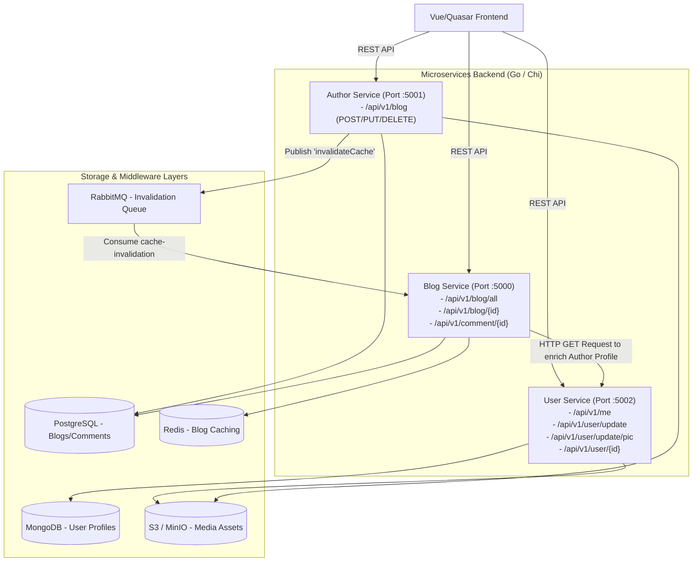

# Project Architecture - Postly Blog Platform

This document outlines the architecture, data flows, and scaling strategies of the Postly blog application.

---

## System Overview

Postly is built using a decoupled microservices architecture with a responsive Vue/Quasar frontend. The backend services are written in Go, utilizing a Service-Repository pattern, backed by caching, message brokers, and relational/document databases.



---

## 1. Frontend Application (`frontend/`)

- **Tech Stack:** Vue 3, TypeScript, Vite, and the **Quasar Framework** (compiled for SPA mode).
- **State Management:** **Pinia** (stores authentication tokens, user metadata, global search states, and loaded feeds).
- **Responsive Layout:** Dynamic responsive breakpoints mapped to Quasar's `$q.screen` variables.
- **Scaling Strategies:**
  - **Virtualized Grid Layout:** Groups flat arrays of posts dynamically into visual rows according to window size (4 columns on desktop, 1 on mobile).
  - **QVirtualScroll:** Dynamically destroys off-screen blog list nodes and recycles DOM elements, keeping browser DOM count fixed (~20 active nodes) and memory consumption low.
  - **QInfiniteScroll:** Loads paginated blog records from the API on-demand as the user scrolls, preventing initial screen loading delays.

---

## 2. Microservices (Go/Chi Backend)

The backend consists of three independent microservices communicating via REST and asynchronous messaging. They are designed around a clean Service-Repository pattern to separate business logic from data access.

### A. User Service (Port 5002)
- **Role:** Handles user registration, authentication, JWT tokens, profile operations, and user avatar updates.
- **Database:** MongoDB (handles flexible user profile documents).
- **File Storage:** Uploads profile pictures to S3 / MinIO.

### B. Author Service (Port 5001)
- **Role:** Handles blog creation, blog modifications, and deletions by authorized authors.
- **Database:** PostgreSQL.
- **File Storage:** Uploads cover images to S3 / MinIO.
- **Message Broker:** Publishes cache invalidation payloads to RabbitMQ upon blog mutations.

### C. Blog Service (Port 5000)
- **Role:** Serves reading operations. Lists all blogs (paginated), single blog lookups (joining external author data from User Service), comments, and bookmark states.
- **Database:** PostgreSQL.
- **Caching:** Redis.
- **Message Broker:** Consumes invalidation messages from RabbitMQ to drop and refresh cache segments.

---

## 3. Data & Caching Strategy

To achieve sub-millisecond responses and handle scale, the system heavily utilizes layered storage:

```
[Request] ---> [Redis Cache Check] --(Cache Hit)---> [Return Data]
                       |
                  (Cache Miss)
                       |
                       v
         [Query PostgreSQL / MongoDB] ---> [Set Redis Cache] ---> [Return Data]
```

### Caching Coordinates
Cache keys are designed to incorporate query parameters and pagination ranges:
- **Feed Key:** `blogs:searchQuery:category:limit:offset` (e.g. `blogs:ai:Technology:12:24`)
- **Single Blog Key:** `blog:id` (e.g. `blog:105`)

---

## 4. Cache Invalidation Flow (RabbitMQ)

When an author creates, updates, or deletes a blog:
1. The **Author Service** commits the change to PostgreSQL.
2. It pushes a payload to the `cache-invalidation` queue in **RabbitMQ**:
   ```json
   {
     "action": "invalidateCache",
     "keys": ["blogs:*"]
   }
   ```
3. The background cache consumer inside the **Blog Service** detects the message:
   - Invalidates all matching `blogs:*` keys in Redis.
   - Queries the database for the first page (`limit=12, offset=0`).
   - Marshals and updates the default cache key (`blogs:::12:0`) proactively so the next page visitor hits a warmed cache.

---

## 5. Security & Middleware

- **Rate Limiting:** Protects endpoints from DDoS/abuse using token-bucket rate limiting middleware.
- **Max Body Size Check:** Constrains HTTP request bodies (e.g. max 10MB limits on image uploads).
- **CORS Middleware:** Limits cross-origin calls to verified client domains.
- **Context Authentication:** Standard JWT middleware decodes user claims and injects them securely into request contexts.
